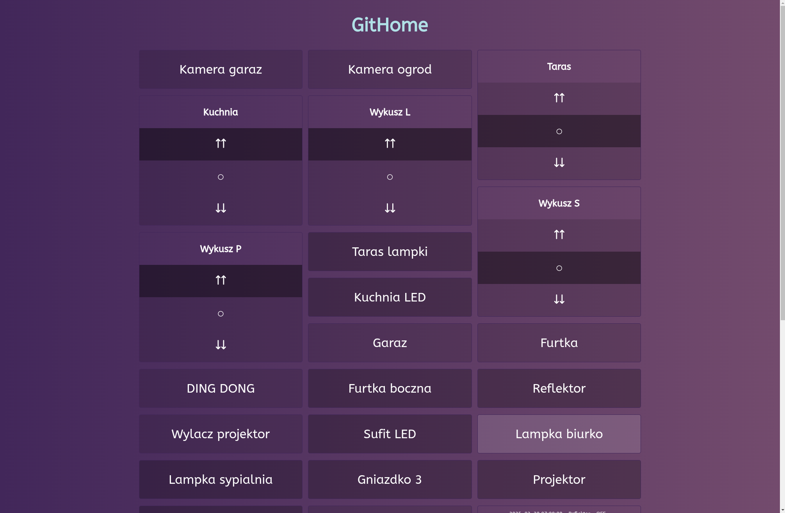
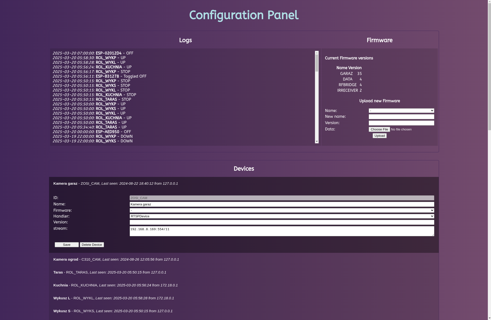

# GitHome
GitHome is a Personal SmartHome solution written in pure PHP and C++ with some Python for comprehensive home automation.


## Overview

GitHome provides a platform for connecting and managing various smart home devices and sensors.

It uses PHP as core with MySQL for persistence and C++ for the endpoint functionality.

## Features

- Device management and control interface
- Sensor monitoring and logging
- Automation rules creation
- Customizable dashboard with easy custom-code tile support
- Low resource requirement design
- Cross-platform compatibility
- Built-in support for:
    1. [ESP8266 Relay Module](https://www.google.com/search?q=esp8266+relay+module)
    2. [CAME 433Mhz Blinds via RF module endpoint](/Arduino/RfBridge/)
    3. [DS18B20 temperature logging](/Arduino/WeatherStation/)
    4. RTSP stream (frame-capturing via ffmpeg)
    5. [TUYA devices](/VirtualDevices/)
    6. [Wake On Lan](/VirtualDevices/)
    7. [HikVision DVR Restart]((/VirtualDevices/))
    8. [Custom GET/POST]((/VirtualDevices/))

## Installation

### Prerequisites

- A server

### Setup

Using Docker Compose:

``` yaml
version: '3.1'

services:
  server:
    image: ghcr.io/gitmanik/sh_server:master
    restart: always
    ports:
      - 80:80
    environment:
      MYSQL_USER: username
      MYSQL_PASSWORD: password
      MYSQL_SERVER: db
      MYSQL_DB: smarthome
    volumes:
      - ./data:/data:rw
  db:
    image: mariadb
    restart: always
    ports:
      - 3306:3306
    volumes:
      - ./db:/var/lib/mysql
    environment:
      MARIADB_ROOT_PASSWORD: password
      MYSQL_USER: username
      MYSQL_PASSWORD: password
```

As of today, GitHome does not support automatic database creation. You need to create structure given below yourself.

``` sql
CREATE TABLE `cron` (
  `id` int(11) NOT NULL,
  `name` text NOT NULL,
  `code` text NOT NULL
);

CREATE TABLE `devices` (
  `id` text NOT NULL,
  `handler` text NOT NULL,
  `firmware` text DEFAULT NULL,
  `name` text NOT NULL,
  `version` int(11) DEFAULT NULL,
  `lastReportTimestamp` timestamp NULL DEFAULT NULL,
  `lastReportIP` text DEFAULT NULL,
  `data` text NOT NULL
);

CREATE TABLE `firmware` (
  `name` text NOT NULL,
  `version` int(11) NOT NULL,
  `file` mediumblob DEFAULT NULL,
  `id` int(11) NOT NULL AUTO_INCREMENT,
  PRIMARY KEY (`id`)
);

CREATE TABLE `logs` (
  `id` int(11) NOT NULL AUTO_INCREMENT,
  `level` int(11) NOT NULL DEFAULT 0,
  `date` datetime NOT NULL DEFAULT current_timestamp(),
  `device_id` varchar(32) NOT NULL,
  `data` text NOT NULL,
  PRIMARY KEY (`id`)
);

CREATE TABLE `redirect` (
  `id` varchar(100) NOT NULL,
  `target` text NOT NULL,
  PRIMARY KEY (`id`)
);

CREATE TABLE `temperature` (
  `id` int(11) NOT NULL AUTO_INCREMENT,
  `date` timestamp NOT NULL,
  `sensor` text NOT NULL,
  `value` text NOT NULL,
  PRIMARY KEY (`id`)
);
```

## Configuration

GitHome can be configured using configuration panel located at `/config`

